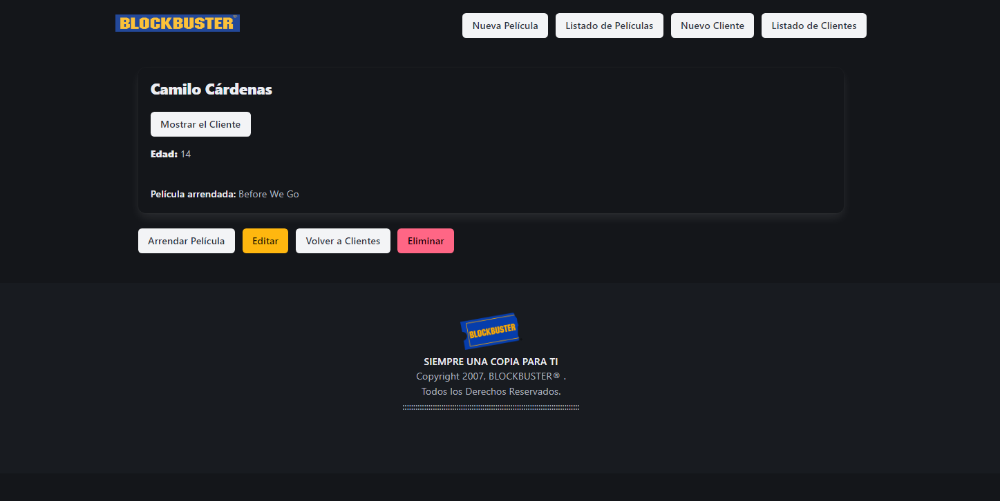

# DESARROLLO RUBY ON RAILS PARA EMPRENDIMIENTOS DE TIPO STARTUP

DESAFÍO - RELACIONES 1 a N EN LOS MODELOS

## Autor

- [@Carlos-Cardenas-Bravo](https://github.com/Carlos-Cardenas-Bravo)

## Lógica utilizada

Se buscó simular el sistema de registros de arriendos de peliculas por diferentes clientes, tomando en cuenta el hipotético caso de que una película puede ser arrendada por más de un cliente y el cliente SOLO puede arrendar una película a la vez.

La lógica que se siguió fue generar una base de datos con dos tablas (Client y Movie) de forma que la PK de Movie fuera una FK de CLient y asi vincularlas.

Se generó una vista inicial donde se despliegan por defecto todas las péliculas disponibles (indicando los clientes a los cuales está asignada o si no está asinada a ninguno), generadas con seed y faker y paginadas con pagy. Desde esta se puede acceder a desplegar la pelicula deseada y ahi poder editarla, eliminarla o volver al listado. Además se puede buscar una película por su nombre, generado con pg_search.

Se implmentó un navbar donde se puede acceder a crear una nueva película, listar las películas, craer un usuario o listar todos los usuarios existente.

Al crear una nueva película se puede en el mismo momento asignarle un cliente de los existentes los cuales se despliegan para escogerlo, o simplemente craer la pelicula sin asignarle ningún cliente.
Listar películas nos lleva a la misma página inicial.

Al ir a crear un cliente se le puede asignar en el mismo momento una pelicula de las existentes que se despliegan para elegirla. De igual forma se puede crear un cliente sin ninguna asignación.

Al listar los clientes se muestran todos los existentes (indicando si tienen o no asignado una pelicula y cual). Se puede acceder a una película en particular en cuya vista se puede editar, eliminar, volver al listado de clientes o asignarle una película existente. Este último punto aún está en construcción ya que en la vista se puede elegir la pelicula pero aún no he podido configurar bien el método para que se asigne el ID de la película selecionada a la FK del usuario.
En este vista se chequea que el usuario no tenga una película asignada lo que debe generar una alerta al tratar de asignarle una segunda, según la condicionante que tenía el desafio.

Se generó además un footer que recuerda el footer original que tenía Blockbuster elaño 2007.

Se ocupó el framework de css Bulma para darle estilo a la aplicación.

## Versiones Utilizadas

Para tener una funcionalidad completa de la aplicación debes tener las siguientes versiones de los softwares utilizados.

`Ruby 3.3.3`

`Rails 7.2.1 `

## 🚀 About Me
I'm a human apprentice

